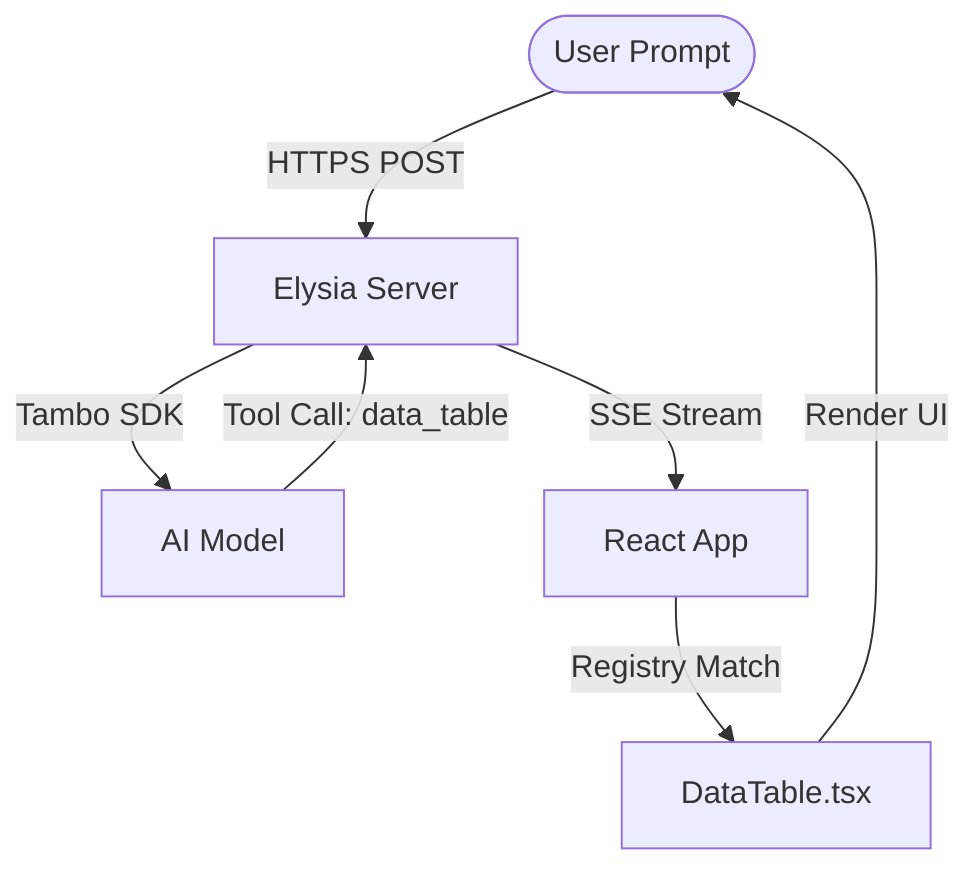

# Tambo + Elysia.js + Bun Starter Template 🥁⚡️

A high-performance, developer-first starter template for the [Tambo](https://tambo.ai) ecosystem. Built with **Elysia.js** and **Bun**, this template provides a blazingly fast foundation for building Generative AI applications with the **Lumina** minimal design system.

## 🚀 Why use this template?

- **Extreme Performance**: Powered by **Bun** and **Elysia.js**, delivering the lowest possible latency for AI streaming.
- **Hackathon Ready**: Designed as a perfect starting point for the _UI Strikes Back_ hackathon.
- **Generative UI First**: Deep integration with the Tambo React SDK for streaming interactive components.
- **Type Safety**: End-to-end type safety from the backend tools to the frontend components.

## ✨ Features at a Glance

- **Bun Monorepo**: Clean separation between `apps/web` and `apps/server`.
- **Elysia AI Layer**: Optimized for real-time text and tool streaming.
- **Custom Component Registry**: Easy-to-extend registry in `tambo/registry.ts`.
- **Power Prompts**: Pre-configured suggestions to showcase the template's capabilities instantly.

## 🛠️ Getting Started

### Prerequisites

- [Bun](https://bun.sh) (Recommended)
- [Tambo API Key](https://tambo.ai)

### 1. Quick Start

```bash
# Install dependencies
bun install

# Setup environment
cp .env.example .env
# Add your TAMBO_API_KEY to .env

# Run development server
bun dev
```

- **Frontend**: http://localhost:5173
- **Backend**: http://localhost:3000

## 🏗️ Project Architecture

Lumina bridges high-performance backend logic with generative frontend UI.



## 📂 File Structure

```text
elysiajs-tambo-template/
├── apps/
│   ├── server/           # Elysia.js + Bun Backend
│   │   └── src/
│   │       ├── ai.ts     # Main AI stream handler
│   │       └── tools.ts  # JSON Tool schemas for the model
│   └── web/              # React + Vite Frontend
│       └── src/
│           ├── App.tsx   # Chat interface & grouping logic
│           ├── components/ # Modernized Lumina UI library
│           └── tambo/    # Registry & SDK configuration
└── README.md             # Documentation
```

## 🧠 The Lumina Loop

1. **Tool Definition**: Define your backend logic in `apps/server/src/tools.ts`.
2. **Component Mapping**: Register the visual counterpart in `apps/web/src/tambo/registry.ts`.
3. **Generative Stream**: Tambo handles the heavy lifting, streaming components directly into the Lumina thread.

## 📋 Competition Submission

This template is built following the Tambo Community Standards.

- [x] Meets performance requirements (Elysia + Bun)
- [x] High-fidelity UI (Lumina Design System)
- [x] Clear monorepo structure

## 📄 License

MIT. Built for the Tambo Community.
