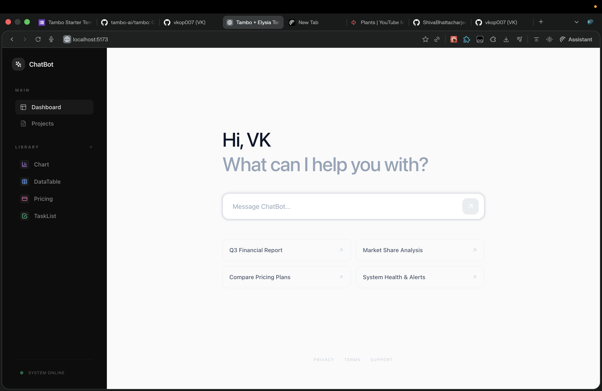
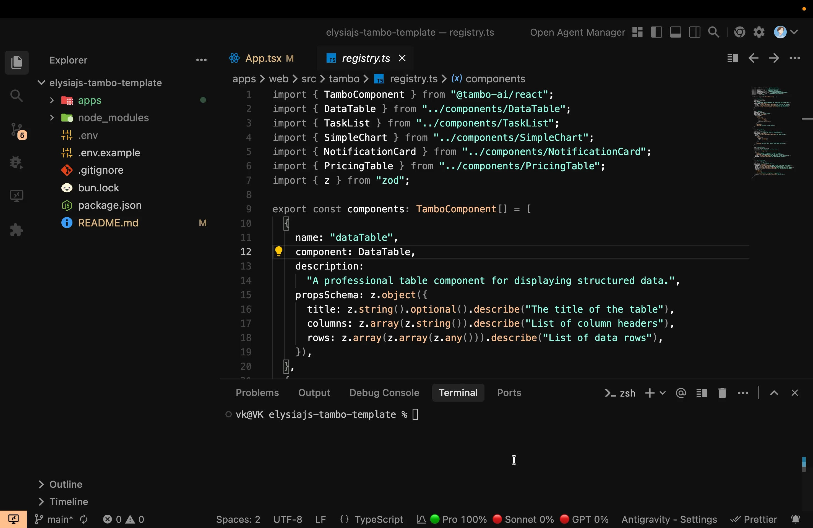

# Tambo + Elysia.js + Bun Starter Template 🥁⚡️

A high-performance, developer-first starter template for building Generative AI applications with Elysia.js and Bun.

## 🖼️ Preview



### 🎥 Demo Video



---

## ✨ Features at a Glance

- **Bun Monorepo**: Clean separation between `apps/web` and `apps/server`.
- **Elysia AI Layer**: Optimized for real-time text and tool streaming using `RunCreateParams`.
- **Custom Component Registry**: Easy-to-extend registry in `apps/web/src/tambo/registry.ts`.
- **Power Prompts**: Pre-configured data-rich suggestions to showcase Generative UI instantly.

## 🛠️ Getting Started

### Prerequisites

- [Bun](https://bun.sh) installed.
- [Tambo API Key](https://tambo.ai) (Add to `.env`).

### Setup Steps

1. **Install dependencies**:

   ```bash
   bun install
   ```

2. **Setup environment**:

   ```bash
   cp .env.example .env
   # Add your TAMBO_API_KEY to .env
   ```

3. **Run development server**:
   ```bash
   bun dev
   ```

- **Frontend**: http://localhost:5173
- **Backend**: http://localhost:3000

## 📦 What's Included

- **Bun**: Fast JavaScript runtime and package manager.
- **Elysia.js**: High-performance web framework for the backend.
- **Tambo React SDK**: For streaming interactive AI components.
- **Chatbot Design System**: Modern, dark-mode focused UI.

## 📋 Tambo Integration

This template demonstrates a robust integration between a high-performance Elysia backend and a React frontend:

- **Backend**: Tool definitions using `RunCreateParams` logic.
- **Frontend**: Seamless mapping in `registry.ts` with Zod schema validation.
- **Demo**: Use the "Master Showcase" prompt to see Notifications, Pricing, Charts, TaskLists, and DataTables stream in real-time.

---

## 📄 License

MIT. Built for the Tambo Community.
